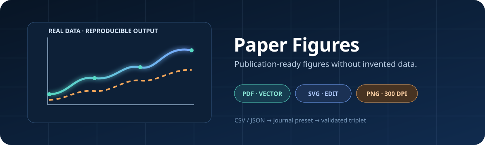

<div align="center">
  

  # Paper Figures

  **Turn real research data into reproducible, journal-ready figures.**

  [](https://github.com/Taxueovo/paper-figures/actions/workflows/ci.yml)
  [](https://www.python.org/)
  [](LICENSE)
</div>

Paper Figures is a Python CLI and agent skill for academic visualization. It consumes your CSV or JSON input, applies a validated journal preset, and writes an exact PDF + SVG + 300-DPI PNG triplet. It never invents measurements.

## Why it is reliable

- **Real inputs only** — built-in generators read explicit CSV or JSON files.
- **Five useful figure families** — training curves, prediction/error plots, grouped bars, sensitivity maps, and architecture diagrams.
- **Deterministic output contract** — a render passes only when the expected files were created or changed by that run.
- **Meaningful validation** — PNG integrity, dimensions and DPI; SVG structure; PDF header and end marker.
- **Safe defaults** — existing project files are not overwritten without `--force`; batch failures return a failing exit code.
- **Journal presets** — Generic, IEEE, Nature, Elsevier, and ACM typography and dimensions.

> [!IMPORTANT]
> `paper-figures render` runs a Python file as a subprocess. This is process isolation, not a security sandbox. Only render code you trust.

## Quick start

```bash
git clone https://github.com/Taxueovo/paper-figures.git
cd paper-figures
python -m venv .venv
source .venv/bin/activate
python -m pip install -e .
```

Generate a training figure from the included real-data example:

```bash
paper-figures generate training \
  --data examples/training_metrics.csv \
  --x epoch \
  --series train_loss val_loss \
  --name training-curves \
  --output-dir figures/export
```

The command creates:

```text
figures/export/
├── training-curves.pdf   # vector output for LaTeX
├── training-curves.svg   # editable vector output
└── training-curves.png   # 300-DPI preview / Word output
```

## Figure recipes

```bash
# Prediction quality and residual distribution
paper-figures generate scatter --data examples/predictions.csv

# Grouped method comparison
paper-figures generate bar --data examples/method_comparison.csv \
  --category method --series accuracy f1_score

# Two-parameter sensitivity heatmap
paper-figures generate sensitivity --data examples/sensitivity.csv \
  --x alpha --y beta --value score

# Architecture from an explicit graph specification
paper-figures generate architecture --data examples/architecture.json
```

Use `--config figures/style_config.json` with any command to apply a project-specific preset.

## Reproducible project workflow

```bash
# Create src/, export/, a figure plan, and an IEEE style config.
paper-figures setup figures --journal ieee

# Inspect likely data/model sources without changing the project.
paper-figures setup --scan-only

# Render one trusted custom figure source.
paper-figures render figures/src/fig_01_results.py

# Render every fig_*.py source and propagate any failure.
paper-figures batch --src-dir figures/src --export-dir figures/export

# Validate every export triplet; fail on any issue.
paper-figures check figures/export --strict
```

The scripts under `scripts/` remain as compatibility wrappers for existing users. New integrations should call the `paper-figures` command or import `paper_figures` directly.

## Input contracts

| Type | Minimum input | Useful overrides |
| :--- | :--- | :--- |
| `training` | numeric x + one numeric series | `--x`, `--series` |
| `scatter` | two numeric columns, 2+ complete rows | `--truth`, `--prediction` |
| `bar` | category + one numeric series | `--category`, `--series` |
| `sensitivity` | numeric x + value; optional numeric y | `--x`, `--y`, `--value` |
| `architecture` | JSON `nodes` and valid `[source, target]` edges | node `label`, `group`, `x`, `y` |

Declarative examples live in [`templates/`](templates), detailed design guidance in [`references/`](references), and agent workflows in [`workflows/`](workflows).

## Development and security

```bash
python -m pip install -e ".[dev]"
ruff format --check paper_figures tests scripts
ruff check paper_figures tests scripts
pytest
python scripts/release_audit.py
```

Every pull request runs the suite on Python 3.10, 3.12, and 3.13. Dependabot monitors both Python and GitHub Actions dependencies. See [SECURITY.md](SECURITY.md) for private vulnerability reporting and [CONTRIBUTING.md](CONTRIBUTING.md) for contribution guidelines.

## License

[MIT](LICENSE) © 2026 Taxueovo
